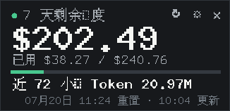

# Token Quota Widget

English | [简体中文](README.md)



A minimal transparent Linux desktop widget for the Quota Share API. It stays on top, can be dragged anywhere, and displays:

- Used, remaining, and reset time for the 7-day quota
- Total token usage over the last 72 hours
- Input, output, cache-read tokens, and request count in a tooltip
- Chinese and English interfaces

The application uses only the Python standard library and Tk. It has no third-party runtime dependencies.

## Run

Requires Python 3.11+ and Tk 8.6:

```bash
python3 -m token_quota_widget
```

Preview the UI with demo data and no network access:

```bash
python3 -m token_quota_widget --demo
```

## Desktop installation

```bash
chmod +x install.sh uninstall.sh
./install.sh
```

Launch **Token Quota** from the application menu. To start it automatically after desktop login:

```bash
./install.sh --autostart
```

Uninstall the application files:

```bash
./uninstall.sh
```

## API key

The key is resolved in this order:

1. `QUOTA_SHARE_API_KEY` environment variable
2. `~/.codex/auth.json` for the provider active in `~/.codex/config.toml`
3. Manual entry in Settings

Before reading a Codex key, the application verifies that the active provider's `base_url` has the same host as the quota endpoint. This prevents an OpenAI or unrelated provider key from being sent to the wrong service.

Manually entered keys stay in memory for the current process only. Keys are sent in the `Authorization: Bearer ...` header, never in the URL, and are never written to the widget configuration file.

## Refresh intervals

- `mode=light`: every 15 seconds by default, configurable from 5 to 300 seconds
- `mode=full`: every 65 seconds with a manual-refresh throttle, used for 72-hour token totals

Both defaults stay below the service limits of 30 light and 3 full requests per minute. Cumulative history remains available on the website only.

## Language

Open Settings with the gear button, choose `中文` or `English`, and save. The selected language is stored alongside opacity, refresh interval, and window position. No API key is stored there.

## Data semantics

The remaining balance comes directly from `rate_limits.remaining` and its unit; the current service reports USD. The 72-hour figure uses `usage.total_tokens`, which includes input, output, cache-creation, and cache-read tokens reported by the API.

## Tests

```bash
python3 -m unittest discover -s tests -v
```

## License

MIT
